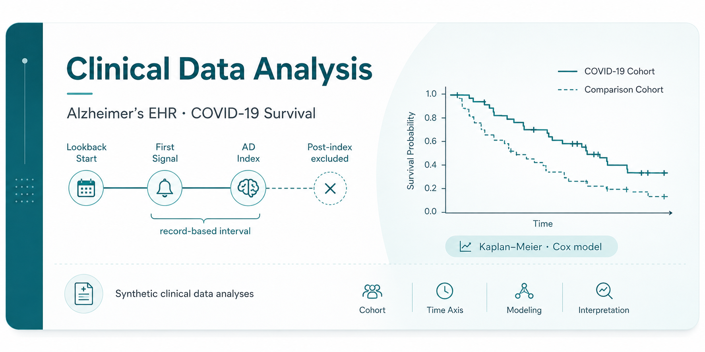
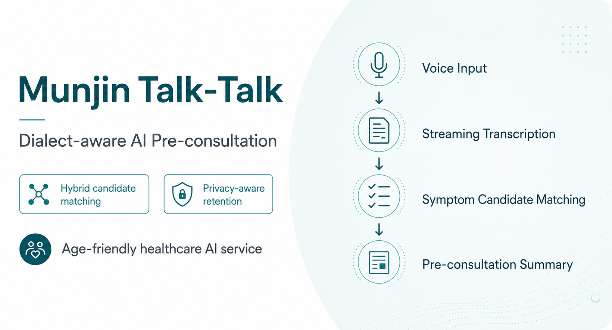
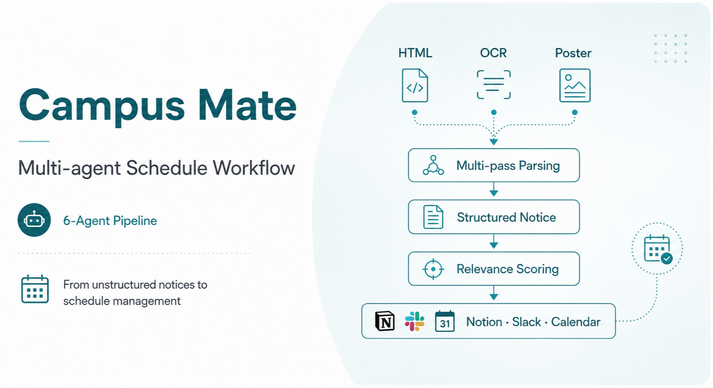

<h1 align="center">Gibum Choi · 최기범</h1>

  Undergraduate Student at Kangwon National University 
  Artificial Intelligence Convergence · Precision Medicine Convergence

  <strong>Research Interests</strong> 
  Digital Healthcare · Precision Medicine 
  Computational &amp; Statistical Genetics · Clinical Data Analysis / AI

---

## Selected Work

  

Selected analyses using synthetic clinical data, focused on how cohort, time-axis, and variable definitions affect the interpretation of results.

- **Alzheimer’s EHR analysis** — Defined a 10-year lookback and first signal, mapped 24 candidate conditions into six clinical domains, and applied logistic regression considering event count and age.
- **COVID-19 survival analysis** — Compared Kaplan–Meier curves by obesity status across four comorbidity cohorts and applied a Cox proportional hazards model.
- **Recognition** — Grand Prize (Oral Presentation) for the Alzheimer’s project · Encouragement Award for the COVID-19 project

 

  

A Gangwon-dialect AI pre-consultation service designed for an age-friendly healthcare environment.

- Designed a real-time voice pre-consultation pipeline using AWS serverless services and Transcribe Streaming.
- Designed standard symptom candidate matching with a BM25–vector hybrid structure (**micro-F1 0.89**).
- Raw audio was not retained; session and text data were configured for automatic deletion after three days.
- **Role** — Team · System Design Lead · Excellence Award

**Repository:** [munjin-talk-talk-mvp](https://github.com/CHOIGIBUM/munjin-talk-talk-mvp)

 

  

A multi-agent workflow for collecting, parsing, recommending, and scheduling university competition information.

- Designed and implemented the overall architecture of a six-agent pipeline for collection, parsing, recommendation, and schedule management.
- Structured unstructured notices through HTML, OCR, and poster-vision multi-pass parsing, followed by relevance scoring.
- Integrated Notion, Slack, and Google Calendar to automate the workflow from recommendation to schedule updates.
- **Role** — Team · Architecture &amp; Development Lead · Finalist (7 of 12 Teams)

**Repository:** [Nexus_Harness_Eng](https://github.com/CHOIGIBUM/Nexus_Harness_Eng)

---

## Contact

- Email: [tjdnfi@kangwon.ac.kr](mailto:tjdnfi@kangwon.ac.kr)
