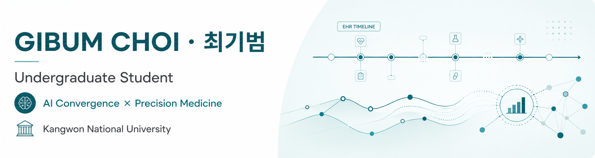
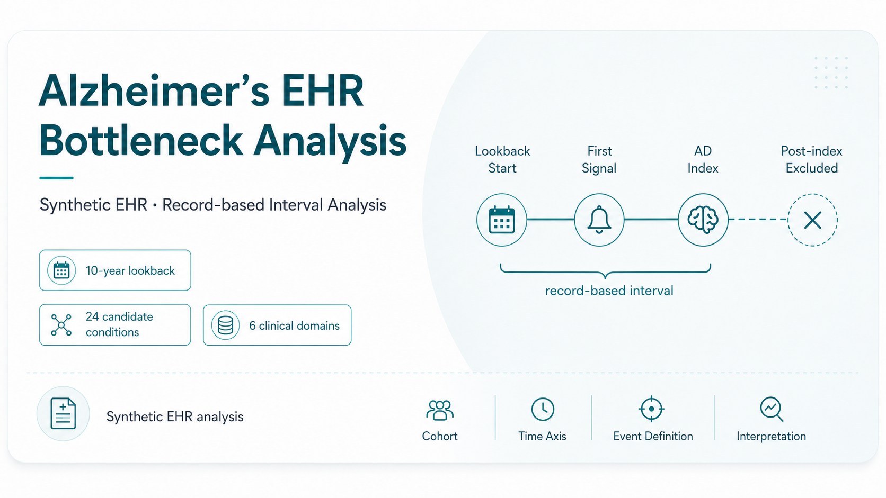
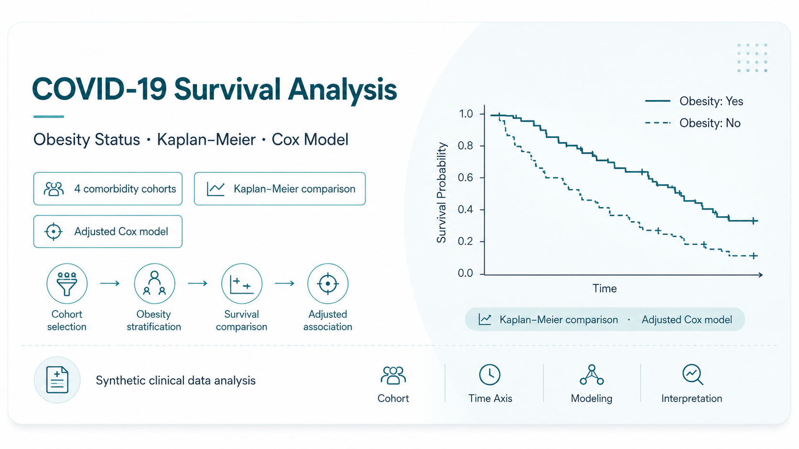

  

  <strong>Research Interests</strong> 
  Digital Healthcare · Precision Medicine 
  Computational &amp; Statistical Genetics · Clinical Data Analysis / AI

---

## Selected Research

### Alzheimer’s EHR Bottleneck Analysis

  

A synthetic EHR analysis of the first recorded comorbidity and the record-based interval to Alzheimer’s disease diagnosis.

- Used the **COMPASS MIMICData Dementia/Alzheimer’s synthetic EHR** and defined a **10-year lookback** before the AD diagnosis date.
- Defined the earliest record among **24 candidate conditions** as the first signal and mapped the conditions into **six clinical domains**.
- Excluded index-day and post-index records, then examined long-interval status using logistic regression with starting domain, event count, and age.
- Compared 5-, 10-, and 15-year lookback windows to assess sensitivity to the analysis definition.
- **Interpretation** — The measured interval represents EHR record timing, not disease onset or a causal diagnostic delay.
- **Role** — Solo · Research &amp; Analysis · Grand Prize (Oral Presentation)

**Repository:** [alzheimer-ehr-bottleneck-analysis](https://github.com/CHOIGIBUM/alzheimer-ehr-bottleneck-analysis)

 

### COVID-19 Survival Analysis

  

A survival analysis of obesity status and comorbidities among patients with COVID-19 using synthetic clinical data from the COMPASS platform.

- Defined four comorbidity cohorts: **hypertension, chronic kidney disease, chronic sinusitis, and metabolic syndrome X**.
- Compared Kaplan–Meier survival curves by obesity status within each cohort.
- Applied a Cox proportional hazards model including age, sex, race, obesity status, and comorbidities.
- After multivariable adjustment, obesity was not retained as significant, while age and hypertension remained associated with mortality risk.
- **Role** — Team · Research Lead · Encouragement Award

**Repository:** [covid19-survival-analysis](https://github.com/CHOIGIBUM/covid19-survival-analysis)

---

## Selected Systems

### Munjin Talk-Talk

  

A Gangwon-dialect AI pre-consultation service designed for an age-friendly healthcare environment.

- Designed a real-time voice pre-consultation pipeline using AWS serverless services and Transcribe Streaming.
- Designed standard symptom candidate matching with a BM25–vector hybrid structure (**micro-F1 0.89**).
- Raw audio was not retained; session and text data were configured for automatic deletion after three days.
- **Role** — Team · System Design Lead · Excellence Award

**Repository:** [munjin-talk-talk](https://github.com/CHOIGIBUM/munjin-talk-talk)

 

### Campus Mate

  

A multi-agent workflow for collecting, parsing, recommending, and scheduling university competition information.

- Designed and implemented the overall architecture of a six-agent pipeline for collection, parsing, recommendation, and schedule management.
- Structured unstructured notices through HTML, OCR, and poster-vision multi-pass parsing, followed by relevance scoring.
- Integrated Notion, Slack, and Google Calendar to automate the workflow from recommendation to schedule updates.
- **Role** — Team · Architecture &amp; Development Lead · Finalist

**Repository:** [campus-mate-ai-agent](https://github.com/CHOIGIBUM/campus-mate-ai-agent)

---

## Contact

- Email: [tjdnfi@kangwon.ac.kr](mailto:tjdnfi@kangwon.ac.kr)
